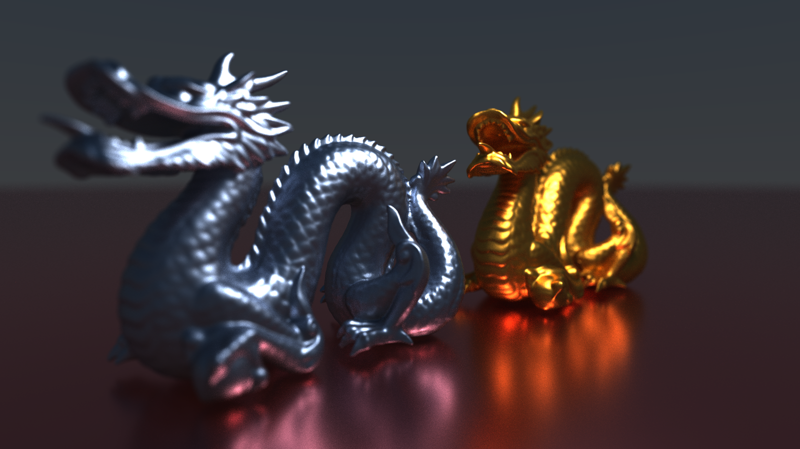
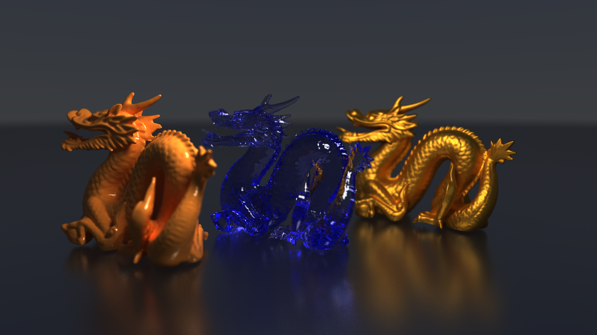
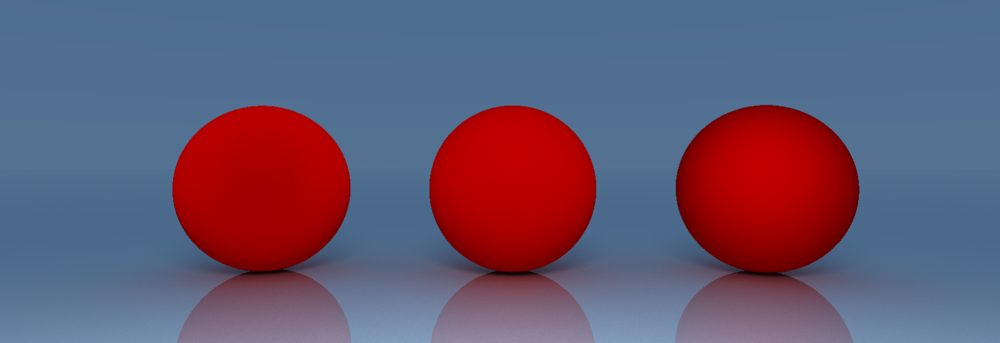
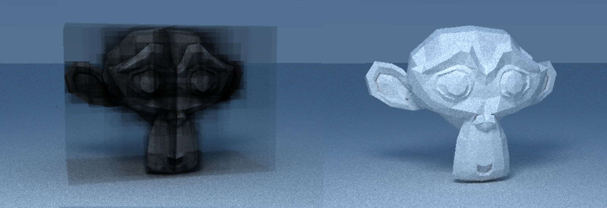
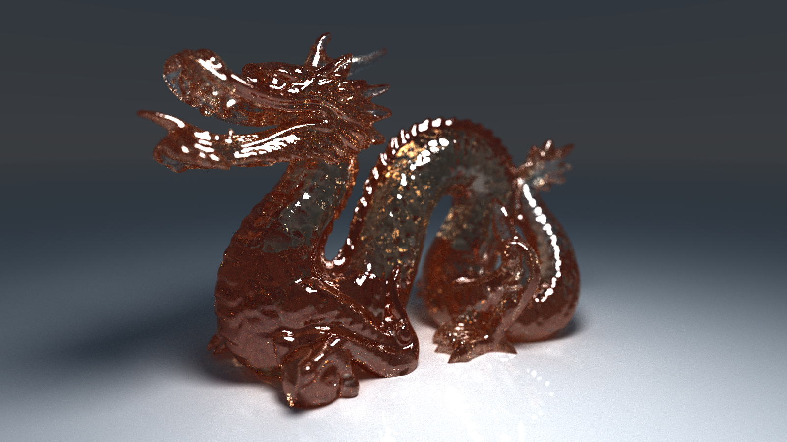

> [!WARNING] 
> This README is not up to date

# Path Tracer – Physically Based Rendering Engine

Interactive GPU path tracer implemented with OpenGL and GLSL, exploring modern physically-based rendering techniques.




## Overview

GPU path tracer built with OpenGL 4.3 / GLSL, progressively accumulating radiance estimates via Monte Carlo integration. The renderer supports full indirect illumination with MIS-weighted NEE, Russian Roulette termination, and a BVH for accelerated traversal.

Materials cover the standard physically-based spectrum: Lambert and EON for diffuse, Cook-Torrance/GGX for conductors, and Fresnel dielectrics with Beer-Lambert absorption. A keyframe animation system allows dynamic scene updates between accumulated frames.

---

## Gallery

All renders are available in the [`outputs/`](outputs/) directory.

| Diffuse (EON)        | Metals (GGX)         | Dielectrics                 |
| -------------------- | -------------------- | --------------------------- |
|  | .png) | .png) |

| Glossy Materials        | BVH Visualization    |
| ----------------------- | -------------------- |
| .png) |  |



## Build & Run

### Requirements

* Windows
* MinGW (g++ with C++17 support)
* OpenGL 4.3+
* Make (mingw32-make recommended)

### Build & Run (Makefile)

```bash
make run
```

---

## Project Structure

```text
Path-Tracer/
├── .vscode/
├── include/
├── lib/
├── models/          # 3D models
├── outputs/         # Rendered images / animations
├── src/
│   ├── shaders/
│   ...
...
├── myprogram.exe
├── Makefile
```

---

## Future Improvements

* Adaptive sampling (variance-based)
* Better BVH construction (SAH)
* Improved caustics (photon mapping)
* Physics-based animation

---

## Author

**Baptiste Girardin** \
Télécom Paris \
[baptiste.girardin37@gmail.com](mailto:baptiste.girardin37@gmail.com) \
[baptiste.girardin@telecom-paris.fr](mailto:baptiste.girardin@telecom-paris.fr)

---

## References

* Cook-Torrance BRDF
* GGX Microfacet Model
* Oren-Nayar / EON diffuse model
* Monte Carlo Rendering
* BVH acceleration structures

---
