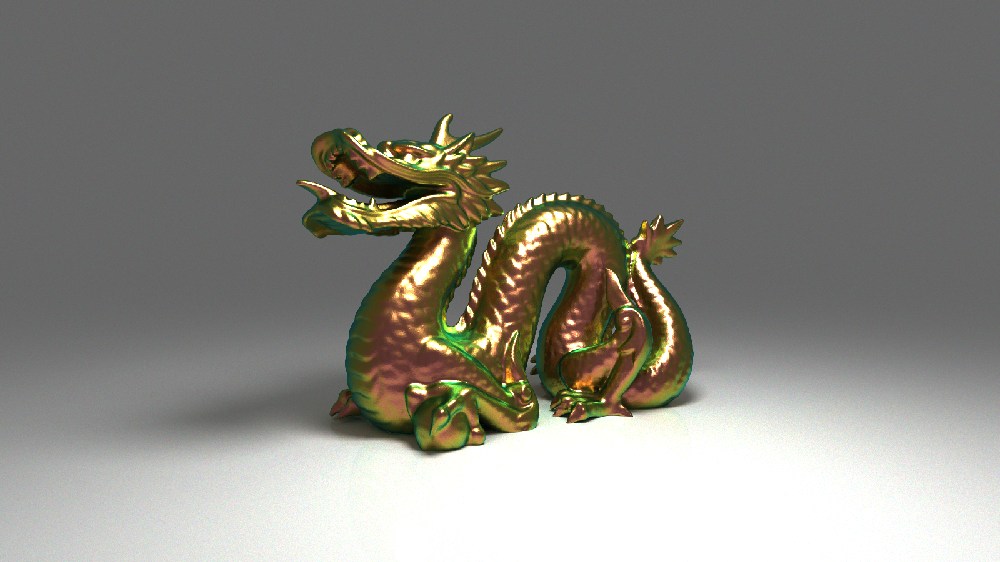
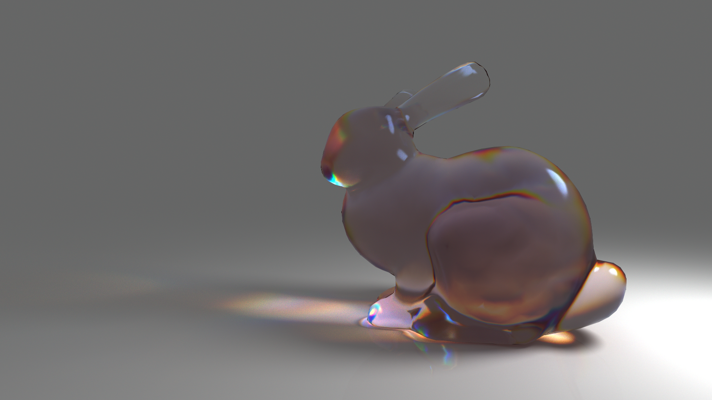
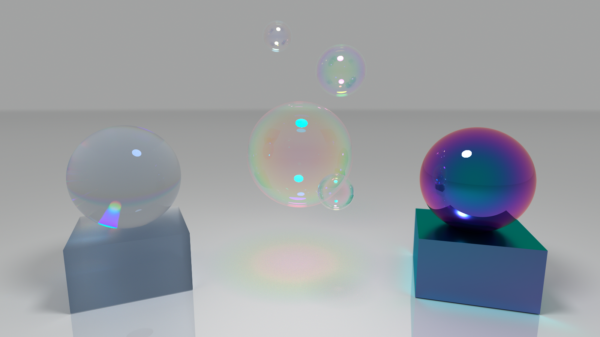

# Path Tracer






## Overview

Progressive, unidirectional path tracer running entirely in a single fragment shader, accumulating frames as the camera and scene remain static. Scene data (triangles, BVH, primitives, materials, lights) is rebuilt on the CPU side and uploaded to SSBOs whenever the scene changes.

Rendering can run in two modes, toggled at runtime: a standard trichromatic RGB path, or a full hero-wavelength spectral path (dispersion, thin-film interference) recompiled on the fly as a shader variant.

---

## Features

### Integrator
- Progressive Monte Carlo path tracing with temporal accumulation, invalidated on camera/scene changes.
- Multiple importance sampling (NEE + BSDF, power heuristic) against spherical and rectangular area lights.
- Russian roulette termination weighted by path throughput.
- Physically based depth of field (thin-lens camera model) and antialiasing via per-frame jitter.

### Materials
- **Diffuse** - EON (Energy-preserving Oren-Nayar), a closed-form multi-scatter energy compensation for rough Lambertian surfaces.
- **Conductors** - Cook-Torrance with the GGX distribution, sampled through the visible normal distribution function (VNDF) for low-variance reflection at grazing angles.
- **Rough dielectrics** - VNDF-sampled microfacet refraction/reflection, from mirror-smooth to fully rough glass, with Beer-Lambert absorption and Cauchy dispersion.
- **Glossy** - stochastic dielectric/metallic layering (metalness workflow) built on the conductor and diffuse BSDFs.
- **Artistic Fresnel** - conductor IOR/extinction (eta, k) reconstructed from intuitive reflectance + edge-tint colors (Gulbrandsen, *Artist Friendly Metallic Fresnel*) instead of raw complex refractive indices.
- **Participating media** - homogeneous volumes with free-flight distance sampling, Henyey-Greenstein phase function, and spectral absorption/scattering coefficients.

### Spectral rendering
- Hero-wavelength spectral integrator (4 wavelengths per path), switchable at runtime against a standard trichromatic RGB path.
- RGB -> reflectance spectrum upsampling using the sigmoid-polynomial method and tabulated coefficients from **pbrt-v4** (Jakob & Hanika, *A Low-Dimensional Function Space for Efficient Spectral Upsampling*).
- CIE 1931 color-matching function approximation for spectral-to-XYZ integration and final linear sRGB conversion, with the D65 illuminant.
- Physically based dielectric dispersion via Cauchy's equation, driving true chromatic splitting/recombination of paths.
- Thin-film interference (Airy summation over multiple internal reflections) for both conductors and dielectrics, driven by film IOR and thickness.

### Acceleration structure
- Per-mesh BVH built with a binned Surface Area Heuristic (16 buckets, longest-axis split), minimizing expected traversal cost instead of naive median splits.
- Flattened GPU-side layout traversed iteratively per ray, with a debug visualization mode.

### Tools
- ImGui-based editor: scene graph, material/light editing, camera controls, live BVH and AOV inspection.
- Keyframe animation system with interpolated scene state between accumulated frames.
- Scene serialization to/from JSON, OBJ mesh import, image export to PNG and EXR (half-float).

---

## Build & Run

### Requirements

- Windows
- MSVC (Visual Studio 2022 Build Tools, C++17)
- CUDA Toolkit + TensorRT (denoiser backend)
- OpenGL 4.3+
- GNU Make (mingw32-make)

### Build & Run

```bash
make run
```

---

## Project Structure

```text
Path-Tracer/
├── include/                  # Third-party headers
├── lib/                      # Third-party import libs / DLLs
├── models/                   # 3D models (OBJ)
├── scenes/                   # Serialized scenes (JSON)
├── outputs/                  # Rendered images / animations
├── src/
│   ├── shaders/               # GLSL: integrator, BSDFs, intersections, spectral utils
│   │   └── materials/          # diffuse / metal / glass / glossy / volume / emit
│   ├── cuda_cpp/               # CUDA-OpenGL interop, TensorRT for potential future denoiser
│   ├── cuda_shaders/            # CUDA kernels (AOV pack/unpack) application loop
├── Makefile
```

---

## Dependencies

| Library | Purpose |
| --- | --- |
| [GLFW](https://www.glfw.org/) | Window/context creation, input |
| [GLAD](https://glad.dav1d.de/) | OpenGL 4.3 function loading |
| [GLM](https://github.com/g-truc/glm) | Vector/matrix math |
| [Dear ImGui](https://github.com/ocornut/imgui) | Editor UI |
| [tinyobjloader](https://github.com/tinyobjloader/tinyobjloader) | OBJ mesh import |
| [tinyexr](https://github.com/syoyo/tinyexr) | EXR image export |
| [lodepng](https://github.com/lvandeve/lodepng) | PNG image export |
| [nlohmann/json](https://github.com/nlohmann/json) | Scene serialization |
| [Native File Dialog](https://github.com/mlabbe/nativefiledialog) | Native open/save dialogs |
| [CUDA](https://developer.nvidia.com/cuda-toolkit) | GPU interop for the denoiser |
| [TensorRT](https://developer.nvidia.com/tensorrt) | Denoiser inference engine |

---

## Future Improvements & Explorations

- ML driven denoising
- Improved animation system and UI
- Adaptive sampling (variance-guided)
- Bidirectional path tracing

---

## References

- Kulla & Conty, *Revisiting Physically Based Shading at Imageworks*
- Heitz, *Sampling the GGX Distribution of Visible Normals*
- Portsmouth et al., *EON: A Practical Energy-Preserving Rough Diffuse BRDF*
- Gulbrandsen, *Artist Friendly Metallic Fresnel*
- Jakob & Hanika, *A Low-Dimensional Function Space for Efficient Spectral Upsampling* (pbrt-v4)
- Pharr, Jakob & Humphreys, *Physically Based Rendering: From Theory to Implementation*
- Henyey & Greenstein, *Diffuse Radiation in the Galaxy*

---

## Author

**Baptiste Girardin** \
Télécom Paris \
[baptiste.girardin37@gmail.com](mailto:baptiste.girardin37@gmail.com) \
[baptiste.girardin@telecom-paris.fr](mailto:baptiste.girardin@telecom-paris.fr)
